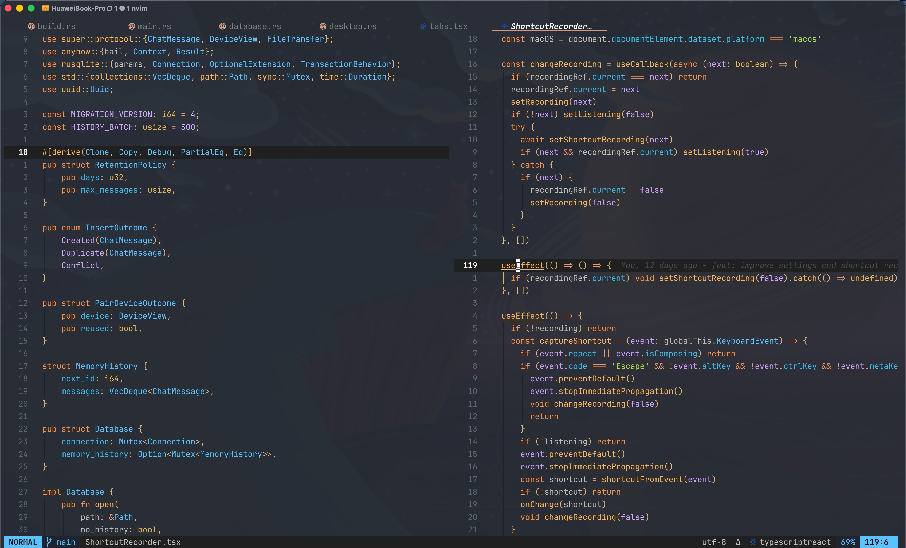

# 🚀 Neovim Configuration

English | [简体中文](./README.zh-CN.md)

A modern Neovim configuration built with Lua, featuring LSP support, autocompletion, fuzzy finding, and a transparent, polished UI. It aims to deliver a powerful IDE-like experience while keeping Neovim simple and fast.



## ✨ Features

- **LSP integration**: full Language Server Protocol support with diagnostics, code actions, and symbol reference highlighting
- **Autocompletion**: powered by blink.cmp (Rust fuzzy matching) with LuaSnip snippets
- **All-in-one toolkit**: snacks.nvim provides the fuzzy finder, file explorer, terminal, notifications, and more
- **Fast navigation**: flash.nvim label-based jumps through `s`, while native character motions remain untouched
- **Testing**: neotest runners for Go, Python, and Vitest with nearest, file, and project scopes
- **Git integration**: Gitsigns, Fugitive, and LazyGit
- **Code formatting**: format on demand via Conform (no format-on-save)
- **Syntax highlighting**: enhanced by Treesitter
- **Transparent UI**: editor, floats, and bars let your terminal background shine through
- **Session management**: per-directory Persistence sessions with jump history isolated between Neovim processes
- **GitHub Copilot**: AI-powered code suggestions

## ⚡️ Requirements

- **Neovim** >= 0.11.0
- **Git** >= 2.19.0
- **Node.js** >= 18.0 (for LSP servers)
- A [Nerd Font](https://www.nerdfonts.com/) (recommended: JetBrainsMono Nerd Font)
- **ripgrep** (for Snacks picker live grep)
- **fd** (optional, for faster file finding)
- **lazygit** (optional, for the `<C-g>` Git TUI)

## 📦 Installation

1. Back up your existing Neovim configuration:
```bash
mv ~/.config/nvim ~/.config/nvim.backup
mv ~/.local/share/nvim ~/.local/share/nvim.backup
```

2. Clone this repository:
```bash
git clone https://github.com/bewater5/nvim.git ~/.config/nvim
```

3. Start Neovim:
```bash
nvim
```

The plugin manager (lazy.nvim) will install all plugins automatically on first launch.

> The transparent background requires transparency enabled in your terminal
> emulator (e.g. iTerm2 Transparency, Kitty `background_opacity`). To restore
> an opaque background, set `M.bg_color` in `lua/core/colors.lua` back to a
> color value (e.g. `M.palette.bg_main`) — one line restores everything.

## 📝 Structure

```
~/.config/nvim/
├── init.lua                   # Entry point and plugin manager setup
├── lazy-lock.json             # Plugin version lockfile
├── lua/
│   ├── core/                  # Core configuration
│   │   ├── options.lua        # Neovim settings
│   │   ├── keymaps.lua        # Keymaps (centralized)
│   │   └── colors.lua         # Unified color management
│   └── plugins/               # Plugin configuration
│       ├── lsp/               # LSP configuration
│       │   ├── init.lua       # LSP entry point
│       │   ├── servers.lua    # LSP server setup
│       │   ├── cmp.lua        # blink.cmp autocompletion
│       │   ├── mason.lua      # LSP installer
│       │   └── languages/     # Per-language configuration
│       ├── ui/                # UI plugins
│       │   ├── statusline.lua # Statusline (lualine)
│       │   ├── bufferline.lua # Buffer tabs
│       │   └── notifications.lua # Notifications (noice)
│       ├── snacks.lua         # snacks.nvim multi-tool
│       ├── colorscheme.lua    # Ayu theme and transparency
│       ├── treesitter.lua     # Syntax highlighting
│       ├── git.lua            # Git integration
│       ├── formatting.lua     # Code formatting
│       ├── snippets.lua       # Snippet engine
│       ├── copilot.lua        # GitHub Copilot
│       ├── neotest.lua        # Test runner configuration
│       └── utils.lua          # Editing enhancements (autopairs, surround, ...)
├── snippets/                  # Custom snippets
└── README.md
```

## 🔌 Core Plugins

| Plugin | Description |
|--------|-------------|
| [lazy.nvim](https://github.com/folke/lazy.nvim) | Modern plugin manager |
| [snacks.nvim](https://github.com/folke/snacks.nvim) | Fuzzy finder, file explorer, terminal, LazyGit, notifications, and more |
| [blink.cmp](https://github.com/saghen/blink.cmp) | Completion engine |
| [nvim-lspconfig](https://github.com/neovim/nvim-lspconfig) | LSP configuration |
| [neotest](https://github.com/nvim-neotest/neotest) | Test runner for Go, Python, and Vitest |
| [flash.nvim](https://github.com/folke/flash.nvim) | Fast navigation |
| [nvim-treesitter](https://github.com/nvim-treesitter/nvim-treesitter) | Syntax highlighting |
| [gitsigns.nvim](https://github.com/lewis6991/gitsigns.nvim) | Git decorations |
| [conform.nvim](https://github.com/stevearc/conform.nvim) | Code formatting |
| [lualine.nvim](https://github.com/nvim-lualine/lualine.nvim) | Statusline |
| [bufferline.nvim](https://github.com/akinsho/bufferline.nvim) | Buffer tabs |
| [noice.nvim](https://github.com/folke/noice.nvim) | Cmdline/message UI |
| [LuaSnip](https://github.com/L3MON4D3/LuaSnip) | Snippet engine |
| [copilot.vim](https://github.com/github/copilot.vim) | AI code suggestions |

## ⌨️ Keymaps

**Leader key**: `<Space>`

### Basics

| Key | Mode | Description |
|-----|------|-------------|
| `jk` | Insert | Exit insert mode |
| `<leader>w` / `<C-s>` | Normal | Save file |
| `<leader>W` | Normal | Save all files |
| `<leader>x` | Normal | Close current window |
| `<leader>Q` | Normal | Close all windows |
| `<leader>nh` | Normal | Clear search highlight |
| `<leader>sv` / `<leader>sh` | Normal | Vertical / horizontal split |

### Search and Find (Snacks picker)

| Key | Mode | Description |
|-----|------|-------------|
| `<leader><space>` | Normal | Find files |
| `<leader>fg` | Normal | Live grep |
| `<leader>fb` | Normal | Find buffers |
| `<leader>fa` | Normal | Find all files (including hidden) |
| `<leader>fr` | Normal | Recent files |
| `<leader>fw` | Normal | Grep word under cursor |
| `<leader>fh` | Normal | Help tags |
| `<leader>no` | Normal | Notification history |

Inside a picker: `<C-j>` / `<C-k>` to move, `<C-q>` to send to quickfix, `<Esc>` to close.

### File Explorer (Snacks explorer)

`<leader>o` toggles a centered floating explorer. Common keys inside the tree:

| Key | Description |
|-----|-------------|
| `l` / `h` | Expand directory or open file / collapse directory |
| `a` / `d` / `r` | Create / delete / rename |
| `c` / `m` / `y` / `p` | Copy / move / yank / paste |
| `H` / `I` | Toggle hidden files / gitignored files |
| `<BS>` / `Z` | Go up one root level / collapse all |
| `q` | Close |

### Completion (blink.cmp)

| Key | Mode | Description |
|-----|------|-------------|
| `<CR>` | Insert | Confirm completion |
| `<C-n>` / `<C-p>` | Insert | Next / previous item |
| `<Tab>` / `<S-Tab>` | Insert | Jump between snippet placeholders |
| `<C-space>` | Insert | Trigger completion |
| `<C-e>` | Insert | Close completion menu |
| `<C-b>` / `<C-f>` | Insert | Scroll docs up / down |

### LSP

| Key | Mode | Description |
|-----|------|-------------|
| `gd` / `gD` | Normal | Go to definition / declaration |
| `gr` / `gi` | Normal | Find references / go to implementation |
| `K` | Normal | Hover documentation |
| `<C-k>` | Normal | Signature help |
| `<leader>rn` | Normal | Rename symbol |
| `<leader>ca` | Normal | Code actions |
| `<leader>e` | Normal | Line diagnostics |
| `[d` / `]d` | Normal | Previous / next diagnostic |
| `<leader>de` / `<leader>dw` | Normal | Buffer / workspace diagnostics list |
| `<leader>uh` | Normal | Toggle inlay hints |

When the cursor rests on a symbol, its LSP references are underlined. Moving
within the same occurrence keeps the highlight; leaving it clears the
highlight.

### Formatting

| Key | Mode | Description |
|-----|------|-------------|
| `<C-l>` | Normal | Format code (Conform) |
| `<leader>F` | Normal | Format code (LSP) |
| `<leader>fl` | Normal | ESLint fix all |

### Buffers and Tabs

| Key | Mode | Description |
|-----|------|-------------|
| `<leader>q` / `<leader>qq` | Normal | Delete / force delete buffer (keeps window) |
| `<leader>qa` / `<leader>qA` | Normal | Close other / all buffers |
| `gt` / `gT` | Normal | Next / previous buffer |
| `<leader>tn` / `<leader>tc` | Normal | New / close tab |
| `t]` / `t[` | Normal | Next / previous tab |

### Tests (Neotest)

| Key | Mode | Description |
|-----|------|-------------|
| `<leader>tr` | Normal | Run the test under the cursor |
| `<leader>tR` | Normal | Run tests in the current file |
| `<leader>ta` | Normal | Run all tests in the current project |
| `<leader>ts` | Normal | Toggle the test summary |
| `<leader>te` | Normal | Open output for the nearest test |
| `<leader>tp` | Normal | Toggle the test output panel |
| `<leader>tx` | Normal | Stop the running test |

### Git

| Key | Mode | Description |
|-----|------|-------------|
| `<C-g>` | Normal | LazyGit |
| `<leader>gs` | Normal | Git status (Fugitive) |
| `]c` / `[c` | Normal | Next / previous hunk |
| `<leader>hs` / `<leader>hr` | Normal/Visual | Stage / reset hunk |
| `<leader>hu` | Normal | Undo stage hunk |
| `<leader>hp` | Normal | Preview hunk |
| `<leader>hb` / `<leader>hB` | Normal | Line blame / full blame |
| `<leader>hd` / `<leader>hD` | Normal | Diff / diff against HEAD |
| `<leader>tb` | Normal | Toggle line blame |

### Terminal (Snacks terminal)

| Key | Mode | Description |
|-----|------|-------------|
| `<C-\>` | Normal/Terminal | Toggle floating terminal |

### Motions and Editing (flash / surround / Comment)

| Key | Mode | Description |
|-----|------|-------------|
| `s` | Normal/Visual/Operator | Flash jump (type chars, then hit the label) |
| `gcc` / `gc{motion}` | Normal | Toggle comment |
| `ys{motion}{char}` | Normal | Add surrounding |
| `ds{char}` / `cs{old}{new}` | Normal | Delete / change surrounding |

Flash character mode is disabled, so `f`, `F`, `t`, `T`, `;`, and `,` retain
their native Vim behavior.

### Sessions and Misc

| Key | Mode | Description |
|-----|------|-------------|
| `<leader>qs` / `<leader>ql` | Normal | Restore session / last session |
| `<leader>qd` | Normal | Don't save current session |
| `<leader>se` | Normal | Edit snippets |
| `<M-]>` / `<M-[>` | Insert | Next / previous Copilot suggestion |

The jumplist is cleared once at startup. `<C-o>` and `<C-i>` therefore navigate
only locations recorded by the current Neovim process.

## 🛠️ Customization

### Adding an LSP Server

Create a language module in `lua/plugins/lsp/languages/` exposing a
`setup(capabilities, on_attach)` function, then register it in the
`languages` table in `lua/plugins/lsp/servers.lua`.

### Tweaking Colors

All colors live in `lua/core/colors.lua`: `M.palette` is the base palette,
`M.bg_color` is the global background switch (`"NONE"` = transparent), and
component colors live in their respective tables.

### Adding Plugins

Create a new file in `lua/plugins/` or extend an existing one:

```lua
return {
  "username/plugin-name",
  config = function()
    -- plugin configuration
  end,
}
```

## 📚 Resources

- [Neovim documentation](https://neovim.io/doc/)
- [Lazy.nvim plugin manager](https://github.com/folke/lazy.nvim)
- [LSP configuration guide](https://github.com/neovim/nvim-lspconfig)
- [snacks.nvim documentation](https://github.com/folke/snacks.nvim)

## 🤝 Contributing

Issues and pull requests are welcome!

## 📄 License

MIT License — feel free to use this configuration as a starting point for your own.
